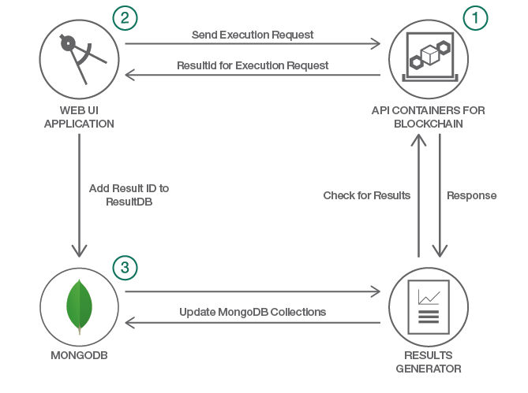

# Load testing the Blockchain Network

This pattern is continuation of the [Controlling flow of request to blockchain network using Redis and RabbitMQ cluster](https://github.com/IBM/controlling-flow-ofRequests-toBlockchain-using-Redis-and-RabbitMQ#controlling-flow-of-request-to-blockchain-network-using-redis-and-rabbitmq-cluster). In this pattern, we are going run java programs to load test our blockchain network i.e. to send request to blockchain network and to check for results of request execution. MongoDb is used to keep track of statistics for the load testing.

## Included Components

* Hyperledger Fabric
* Docker
* Hyperledger Fabric SDK for node.js
* Mongodb
* Java

## Application Workflow Diagram



* Run the ExecutionApp and ResultGenerator java program in separate terminals
* View the execution results in mongodb

## Prerequisites
* Maven

## Steps

* [Set-up the blockchain network](https://github.com/IBM/controlling-flow-ofRequests-toBlockchain-using-Redis-and-RabbitMQ#steps).
* You can either install **mongodb** on your system or run the container for mongodb using the following command.
```bash
docker run -p 27017:27017 -d mongo
```
* Issue a `git clone https://github.com/IBM/loadtesting-the-Blockchain-Network.git`
* Verify the **executionURL**, **resultURL** urls from **ExecutionApp.java** and **ResultGenerator.java**.
* Make sure your are connecting to correct **mongodb** instance and **dbName** are same in **ExecutionApp.java** and **ResultGenerator.java**.
* Open terminal and run the following commands to setup the project
```bash
mvn compile
```
* Now run the test result loader Application
```bash
mvn exec:java -Dexec.mainClass="secretApp.testApp.ResultGenerator"
```
* In a new terminal,run the execution cli app
```bash
mvn exec:java -Dexec.mainClass="secretApp.testApp.ExecutionApp"
```
* If required, you can scale the number of task execution containers by navigating back to the network directory and running the following command:
```bash
docker-compose -p "fitcoin" up -d --scale fitcoin-backend=<No of containers>
```
For eg:
```bash
docker-compose -p "fitcoin" up -d --scale fitcoin-backend=3
```

>Note: To view the results you can download robomongo/ Robo 3T. Currently, ExecutionApp is configured to send enroll request for user types, query request for user state and invoke request for generating fitcoins which can be modified according to the requirements. 

## Additional Resources

* [Hyperledger Fabric Docs](http://hyperledger-fabric.readthedocs.io/en/latest/)
* [Hyperledger Composer Docs](https://hyperledger.github.io/composer/introduction/introduction.html)

## License
[Apache 2.0](LICENSE)
